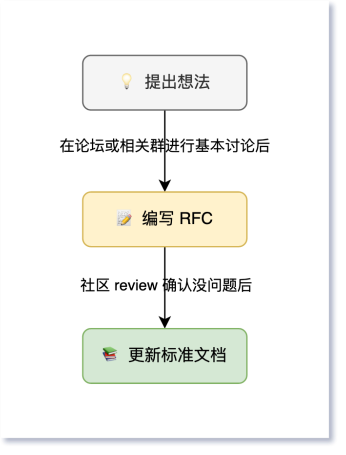

# 贡献指南

向 OneBot 贡献内容应按照下图所示的流程进行，以使标准的维护和更新工作有条不紊。

## 提出想法

当你对 OneBot 有了新的改进建议时，可在 [discussions](https://github.com/howmanybots/onebot/discussions/categories/%E6%83%B3%E6%B3%95-%E5%BB%BA%E8%AE%AE) 或 OneBot 交流群提出，与社区一起讨论建议的可行性和基本方案。

这一阶段对语言表述的规范性没有要求，可以畅所欲言。

## 编写 RFC

在论坛或交流群进行了基本讨论后，提出想法的人或社区中其他有兴趣的人可在 [issues](https://github.com/howmanybots/onebot/issues) 中提出较为正式的 RFC，总结动机、具体实现方案和局限性等，以待社区 review。

编写 RFC 应使用中文，使用较为正式的表述和措辞，如果能遵循 [风格指南](style-guide/README.md) 则更佳。

RFC 从提交到接收需经过下面三个阶段：

1. **草稿**：RFC 刚提出时，有些细节可能还不够完善，在社区 review 后可不断进行修改，直到基本没有问题、且社区和核心维护者基本同意该 RFC 后，进行候选阶段
2. **候选**：RFC 进入候选阶段后，需要开始进行实现，主要就是通过 PR 修改标准文档，PR 可能再次经过一些 review 和修改，完成后，合并 PR、接收 RFC
3. **接收**：RFC 进入接收状态后，锁定 issue，不再进行修改，如发现有其他问题，应从头开始新的 RFC 流程

> 如果变更非常简单，可在草稿阶段就提 PR，缩短流程，此时 RFC 相当于 PR 的说明。

## 更新标准文档

RFC 进入候选阶段后，提出 RFC 的人或社区中其他有兴趣的人可在 [pull requests](https://github.com/howmanybots/onebot/pulls) 中提出 PR，实际地修改标准文档，其中标明所关联的 RFC issue 编号，并在对应 RFC 中标明 PR 编号。经过 review 和修改后，合并 PR，同时将 RFC 转至接收状态。

更新标准文档时，应遵循 [风格指南](style-guide/README.md)。

注意，对标准的更新只应发生在**草案**阶段（例如 `v12-draft`），当一个版本特性稳定后，将发布为正式版本，此后新的变更应创建新的草案版本，正式版本上只可进行小错误修复。
