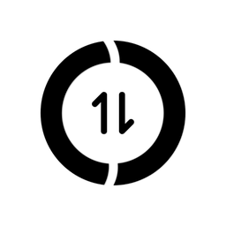

[主页](README.md)　[生态](ecosystem.md)　[更新日志](changelog.md)　标准版本：[v12 草案](v12-draft/specs/README.md)　[v11](v11/specs/README.md)　[v10](v10/specs/README.md)

 

  

# OneBot 标准

一个聊天机器人应用接口标准

 

 

<table>
  <tr>
        <td align=center><h3>简单</h3>接口简单易懂，可轻松接入。 </td>
        <td align=center><h3>兼容性</h3>兼容原 CQHTTP 插件，零负担迁移。 </td>
    </tr>
</table>

